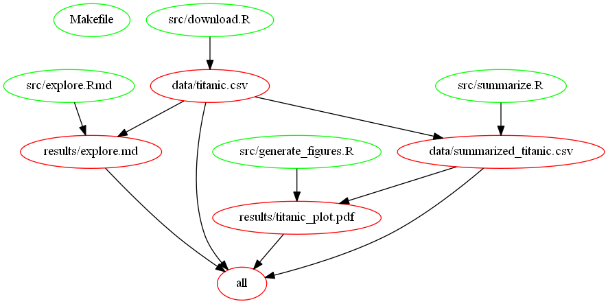

# DSCI 522 Lab 3


Lab 3 Submission- This lab is for getting practice in writing a data analysis pipeline consisting of multiple scripts and in automating this pipeline and making it reproducible using a Shell script, as well as the build tool, Make.

## Overview of contents

**This is the file structure of the project:**

* root /  
    * README.md    
    * [run_all.sh](run_all.sh)    
    * [Makefile](Makefile)    
    * [config.mk](config.mk)    
    * [makefile2graph.png](makefile2graph.png)    
    * / data    
        * titanic.csv    
        * summarized_titanic.csv    
    * / doc    
        * [Exercise4.md](doc/Exercise4.md)    
    * / results    
        * explore.html    
        * explore.md    
        * plot.pdf    
        * /explore    
            * unnamed-chunk-4-1.png    
    * / src    
        * [download.R](src/download.R)    
        * [explore.Rmd](src/explore.Rmd)    
        * [generate_figures.R](src/generate_figures.R)    
        * [summarize.R](src/summarize.R)    

- From the file structure, you can find the:
  - All code file (`.R`, `.Rmd`) live in the `src` directory.
  - All rendered documents live in the `results` directory.
  - All data used belong in the `data` directory.
  - Answers to written questions (e.g., Exercise 4) in the `doc` directory.
  
## Exercise 1 - Notes:


### [download.R](src/download.R)
 This script downloads some data and save it locally.  
- It takes the following as the arguments:   
  - URL pointing to the data.  
  - path/filename where to write the file to and what to call it (e.g., data/data.csv)  

 Sample Usage:
```
 Rscript src/download.R http://biostat.mc.vanderbilt.edu/wiki/pub/Main/DataSets/titanic3.csv data/titanic.csv
```

### [summarize.R](src/summarize.R)
 Reads the data from the first script, performs analysis and writes these numerical data to file in CSV or TSV format
- It takes the following as the arguments:  
 - a path/filename pointing to the data  
 - a path/filename where to write the file to and what to call it (e.g., results/summarized_data.csv)  

 Sample Usage:
```
	Rscript src/summarize.R results/titanic.csv results/summarized_titanic.csv
```

### [generate_figures.R](src/generate_figures.R)
 Reads the data and generate some figures and save them to files
- It takes the following as the arguments:   
 - path/filename pointing to the data  
 - a path/filename prefix where to write the figure to and what to call it (e.g., results/this_analysis)  

 Sample Usage:
```
	Rscript src/generate_figures.R results/summarized_titanic.csv results/histogram_plots
```

### [explore.Rmd](src/explore.Rmd)

Presents original data, the statistical summaries, and/or the figures in a little report.


## Exercise 2 - Notes:

 This script executes the scripts below:
- 1. download.R - Downloads data file from external resource and save it to /data/{filename}.  
- 2. summarize.R - Summarizes the downloaded file, and generate additional data file /data/summarized_{filename}.  
- 3. generate_figures.R - Generate plots under results/plots_{filename}/ folder.  

Sample usage:
```
bash run_all.sh
```
 Description:
- It downloads the http://biostat.mc.vanderbilt.edu/wiki/pub/Main/DataSets/titanic3.csv file into data/titanic.csv  
- Run summarize script on raw data, exports to data/summarized_titanic.csv  
- Run plots on summarized data, exports to results/titanic  
- Export md, pdf, html report from Rmd script into results/ directory  

See [run_all.sh](run_all.sh) file for the work done and descriptions about Exercise 2.

## Exercise 3a - Notes:

Sample Usage:
```
make all
```

For Help:
```
make help
```

For Printing Generic Variables:
```
make variables
```

Different Targets for Makefile:
- plot: Process the data/summarized_titanic.csv and saves the plots into results/titanic_plots/  
- data/summarized_titanic.csv: Process the data/titanic.csv and saves the result in local.  
- data/titanic.csv: Download from external resource saves to local.  
- results/explore.md: Create report.  
- clean: Remove auto-generated files.  
- help: Show variables.  
- variables: Print variables.  

### [Config.mk](config.mk) - Decoupling code from configuration

From the given Makefile tutorial at http://swcarpentry.github.io/make-novice/06-variables/ , it is a good practice to decoupling code from configuration. Therefore I create another [config.mk](config.mk) file and include this file into Makefile.

Tutorial suggest the following:

> We have separated the configuration of our Makefile from its rules, the parts that do all the work. If we want to change our script name or how it is executed we just need to edit our configuration file, not our source code in Makefile.

> Decoupling code from configuration in this way is good programming practice, as it promotes more modular, flexible and reusable code."

See [Makefile](Makefile), and [config.mk](config.mk) files for the work done and descriptions about Exercise 3a.

## Exercise 3b - Notes:



See [makefile2graph.png](makefile2graph.png) is the dependency graph output image file for Exercise 3b.

## Exercise 4 - Notes:

See [doc/Exercise4.md](doc/Exercise4.md) for discussion related with using Makefile vs. Shell script.


## Built With

* RStudio
* Notepad ++

## Authors

Ahu ORAL,  
ahu@alumni.ubc.ca  
Faculty of Science  
University of British Columbia  

## License

Manuscript: CC-BY-4.0 http://creativecommons.org/licenses/by/4.0/

Code: MIT http://opensource.org/licenses/MIT year: 2016, copyright holder: Ahu ORAL

Data: CC0 http://creativecommons.org/publicdomain/zero/1.0/ attribution requested in reuse
