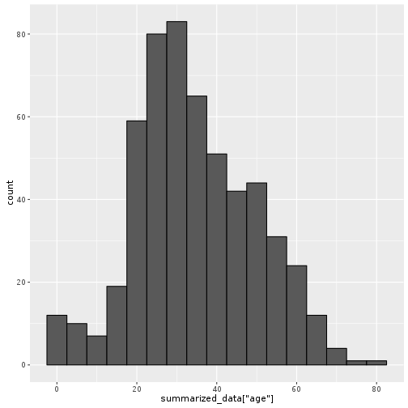

```r
library(RCurl)
```

```
## Loading required package: methods
```

```
## Loading required package: bitops
```

```r
library(tidyverse)
```

```
## Loading tidyverse: ggplot2
## Loading tidyverse: tibble
## Loading tidyverse: tidyr
## Loading tidyverse: readr
## Loading tidyverse: purrr
## Loading tidyverse: dplyr
```

```
## Conflicts with tidy packages ----------------------------------------------
```

```
## complete(): tidyr, RCurl
## filter():   dplyr, stats
## lag():      dplyr, stats
```


## Download the data

```r
raw_data <- getURL("http://biostat.mc.vanderbilt.edu/wiki/pub/Main/DataSets/titanic3.csv", useragent="curl/7.39.0 Rcurl/1.95.4.5")
my_dataset <- read.csv(textConnection(raw_data))
head(my_dataset)
```

```
##   pclass survived                                            name    sex
## 1      1        1                   Allen, Miss. Elisabeth Walton female
## 2      1        1                  Allison, Master. Hudson Trevor   male
## 3      1        0                    Allison, Miss. Helen Loraine female
## 4      1        0            Allison, Mr. Hudson Joshua Creighton   male
## 5      1        0 Allison, Mrs. Hudson J C (Bessie Waldo Daniels) female
## 6      1        1                             Anderson, Mr. Harry   male
##     age sibsp parch ticket     fare   cabin embarked boat body
## 1 29.00     0     0  24160 211.3375      B5        S    2   NA
## 2  0.92     1     2 113781 151.5500 C22 C26        S   11   NA
## 3  2.00     1     2 113781 151.5500 C22 C26        S        NA
## 4 30.00     1     2 113781 151.5500 C22 C26        S       135
## 5 25.00     1     2 113781 151.5500 C22 C26        S        NA
## 6 48.00     0     0  19952  26.5500     E12        S    3   NA
##                         home.dest
## 1                    St Louis, MO
## 2 Montreal, PQ / Chesterville, ON
## 3 Montreal, PQ / Chesterville, ON
## 4 Montreal, PQ / Chesterville, ON
## 5 Montreal, PQ / Chesterville, ON
## 6                    New York, NY
```


## Summarize the data


```r
summarized_data <- my_dataset %>%
  filter(pclass == 1 | pclass == 2) %>%
  select(pclass, survived, sex, age, fare)

summary(summarized_data)
```

```
##      pclass         survived          sex           age       
##  Min.   :1.000   Min.   :0.0000   female:250   Min.   : 0.67  
##  1st Qu.:1.000   1st Qu.:0.0000   male  :350   1st Qu.:24.00  
##  Median :1.000   Median :1.0000                Median :33.00  
##  Mean   :1.462   Mean   :0.5317                Mean   :34.54  
##  3rd Qu.:2.000   3rd Qu.:1.0000                3rd Qu.:45.00  
##  Max.   :2.000   Max.   :1.0000                Max.   :80.00  
##                                                NA's   :55     
##       fare       
##  Min.   :  0.00  
##  1st Qu.: 15.45  
##  Median : 29.70  
##  Mean   : 56.89  
##  3rd Qu.: 73.50  
##  Max.   :512.33  
## 
```

## Plotting the data


```r
my_plot <- ggplot(summarized_data, aes(summarized_data["age"], fill = summarized_data["survived"])) + 
  geom_histogram(binwidth =5, color="black")
my_plot
```

```
## Don't know how to automatically pick scale for object of type data.frame. Defaulting to continuous.
## Don't know how to automatically pick scale for object of type data.frame. Defaulting to continuous.
```

```
## Warning: Removed 55 rows containing non-finite values (stat_bin).
```


